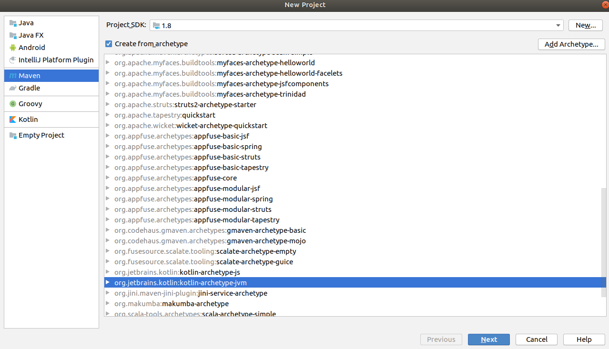
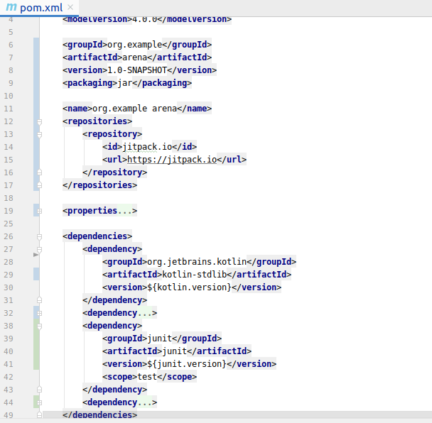
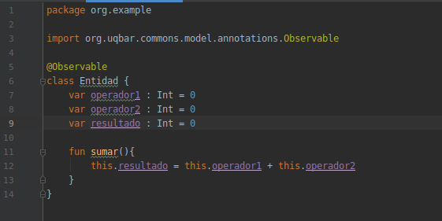
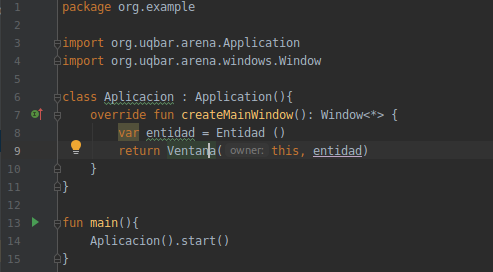
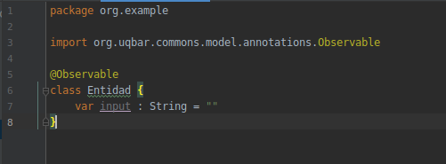
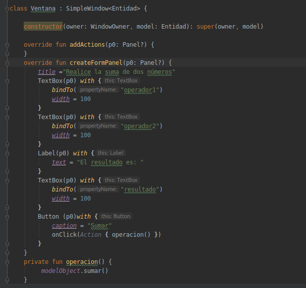

# Cookbook Arena » Guía de Inicio

> La siguiente guía tiene como objetivo detallar un conjunto de pasos
> que deben realizar para armar el ambiente inicial con el framework Arena
> para la construcción de interfaces desktop.

## 1. Descargar el entorno de desarrollo

Descargar el entorno de desarrollo disponible para el SO deseado (IDE - Integrated Development Environment)

<https://www.jetbrains.com/es-es/idea/>

> **Aclaración**: es posible utilizar el IDE Eclipse descargando el plugin para
> visualizar código Kotlin, sin embargo no es lo más recomendable.

## 2. Crear proyecto Maven/Kotlin

Se debe crear un proyecto Maven desde un _archetype_.
De esta forma obtenemos un proyecto vacío con todo lo básico y necesario para comenzar el desarrollo.



Una vez finalizada la construcción del proyecto, automáticamente se agregan
por defecto, dentro del `pom.xml` las dependencias indispensables:
_Kotlin_, _junit_ y plugins que son utilizados para correr la aplicación.

## 3. Agregar Dependencias Arena

Para comenzar con la construcción de interfaces desktop con Arena se debe agregar
la dependencia de Arena en Maven (en el archivo `pom.xml`) junto con el repositorio
donde se encuentra la misma.
Para comprender en profundidad el archivo `pom.xml` puede visualizar la documentación
oficial: <http://maven.apache.org/pom.html#What_is_the_POM>

### 3.a. Agregar dependencia Arena en pom.xml

```xml
<dependency>
   <groupId>com.github.unq-ui</groupId>
   <artifactId>arena-kotlin-extensions</artifactId>
   <version>1.3.0</version>
</dependency>
```

> **Nota**: Esta dependencia debe incluirse dentro de el tag `<dependencies>` como un item mas de la lista.

### 3.b. Agregar repositorio Arena

Dado que la librería Arena no se encuentra en el repositorio por default de Maven,
hay que agregar un repositorio donde pueda ser descargada.

```xml
<repositories>
   <repository>
       <id>jitpack.io</id>
       <url>https://jitpack.io</url>
   </repository>
</repositories>
```

> **Nota**: El repositorio debe incluirse al mismo nivel que `dependencies`,
> pero **no** dentro del tag `<dependencies>`.

Ejemplo de cómo debe quedar:



## 4. Crear una aplicación con ventana Simple

### 4.a. Crear una entidad Simple

Es necesario la creación de una Clase que represente la entidad del Modelo que deseamos que nuestras ventanas visualicen. Dicha información podrá ser visualizada a través del mecanismo de binding.
Para este ejemplo vamos a crear una entidad que realice la suma de dos números
Para crear la clase, en IntelliJ File >> new >> Kotlin File/Class



### 4.b. Crear una Ventana Simple

En IntelliJ: _File >> new >> Kotlin File/Class_

Una vez creada la Clase hacerla extender de la clase `SimpleWindow`
(perteneciente al framework Arena).
Recordar que la forma de extender una clase es mediante los dos puntos `:`.
Es necesario indicarle a la ventana cual es la clase que va a ser utilizada
para obtener la información del modelo. En este caso es la entidad creada en [4.a](#4.a.-crear-una-entidad-simple).
Esto se indica mediante los operadores `<>` como se muestra a continuación.


Una vez finalizada la tarea anterior, la clase `SimpleWindow` obliga a implementar dos métodos.
El IDE lo ayudará a auto-completar dichos métodos.
Dentro del método `createFormPanel` agregaremos más adelante los componentes visuales de la ventana.

### 4.c. Ejecutar la ventana creada

Para poder lanzar o ejecutar la ventana creada en [4.b](#4.b.-crear-una-ventana-simple)
es necesario crear una clase `Main` que se encargue de esto.
Para esto creamos una nueva clase que extienda de la clase `Application`
(clase del framework Arena, cuidado con esto porque puede haber otras clases que se llamen
igual en otras libraries de kotlin o java).
Al hacerlo es necesario implementar el método `createMainWindows` que va a devolver
la ventana creada en el paso [4.b](#4.b.-crear-una-ventana-simple).

En el método `createMainWindows` hay que _instanciar_ la entidad creada en
[4.a](#4.a.-crear-una-entidad-simple) y retornar la ventana creada enviando la entidad como parámetro.
Luego debemos lanzar la aplicación y para eso definimos la función `main` que lanza la aplicación como se ve en la captura.



Por último debemos indicar a la clase modelada como _Entidad_, en este caso, `PruebaEntidad`
que la misma es _observable_. Dicha configuración es necesaria para que la ventana de
Arena esté “Observando” los cambios que sucedan en dicha clase, dado que si cambian,
los mismos deben ser reflejados en la ventana que la utiliza generando de esta forma
un enlace entre la entidad de Dominio y la Ventana, dicha técnica se denomina _Binding_.
Esto se hace agregando un _annotation_ arriba de la clase de la siguiente manera:



### 4.d. Ejecutar la aplicación - parámetro en el _classLoader_

La primera vez que desea correr la aplicación de Arena, el log de IntelliJ muestra el siguiente mensaje:


Este error ocurre debido a que Arena necesita para correr que se le asigne como _classLoader_
uno específico de Arena.
Para solucionar este error en IntellJ ir a la opción "run/debug Configuration"
y en el parámetro VM Options agregar la siguiente línea

```txt
-Djava.system.class.loader=org.uqbar.apo.APOClassLoader
```

> **Nota**: la pueden copiar del log ;)

### 4.e. Agregar componentes a la Ventana

En el método `createFormPanel` de la ventana creada en [4.b](#4.b.-crear-una-ventana-simple)
vamos a agregar:

* Título
* Input para ingresar el primer valor
* Input para ingresar el segundo valor
* Botón para realizar la operación de suma
* Input para mostrar el resultado de la operación



Notar:

* 3 componentes input se encuentran _bindeados_ con variables del modelo a través
  de la operación `bindTo`.
  Esto conlleva que cualquier cambio que haya en el modelo será reflejado en la ventana.
* El evento `onClick` del botón lanza una operación propia del modelo, y como el modelo cambia,
  la ventana también.

La aplicación resultado debería ser similar a la siguiente:


