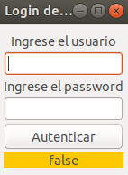
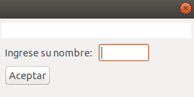

# Práctica 2 >> Interfaz Desktop - Arena

Realizar los ejercicios utilizando el framework Arena y Kotlin.

> **VM arguments**
> 
> Para poder ejecutar código arena, es necesario setear el siguiente class Loader:
> 
> `-Djava.system.class.loader=org.uqbar.apo.APOClassLoader`
>
> En _IntelliJ_ se debe agregar el Class Loader en _Run > Edit Configurations > VM Options_.

## Ejercicio 1: Login

Escribir un programa que permita visualizar una ventana de Login como la siguiente imagen:

El usuario debe poder ingresar usuario y contraseña, al presionar en el botón Autenticar debe verificar que ambos campos son válidos. Se debe indicar en algún lugar de la ventana si ambos campos son válidos o no, por ejemplo, como en la siguiente imagen:

## Ejercicio 2: Calculadora

Escribir un programa que permita visualizar una ventana de una Calculadora como en la siguiente imagen:

El usuario debe poder ingresar el operando 1 y operando 2 y luego 4 botones: Sumar, Restar, Multiplicar y Dividir. 
Al presionar cualquier de los botones, se debe realizar el calculo correspondiente a la operación utilizando los valores ingresados en cada operando.
Nota: contemplar división por cero.

## Ejercicio 3: Nombre y Apellido

Escribir un programa que permita al usuario agregar su nombre y apellido, como se muestra a continuación. 

Para poder agregar el nombre y el apellido, debe hacer click en el botón correspondiente, cada botón debe abrir un Dialog de Arena.

## Ejercicio 4: Compañía

Escribir un programa que permita realizar un listado de los clientes pertenecientes a una compañía. Para la resolución debe utilizar el componente Table de Arena.

